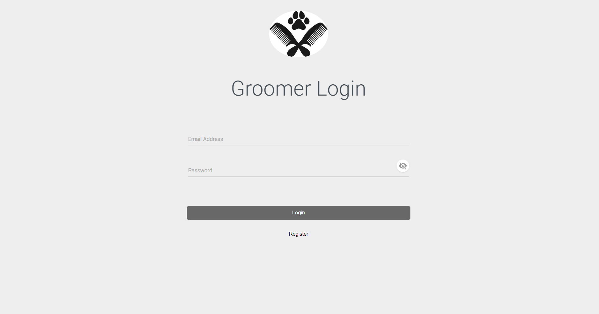
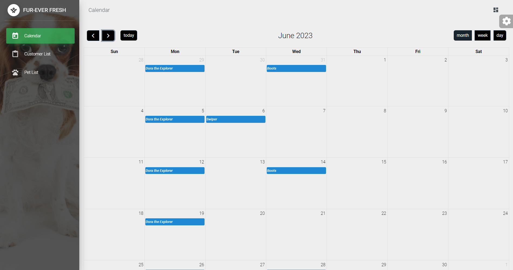
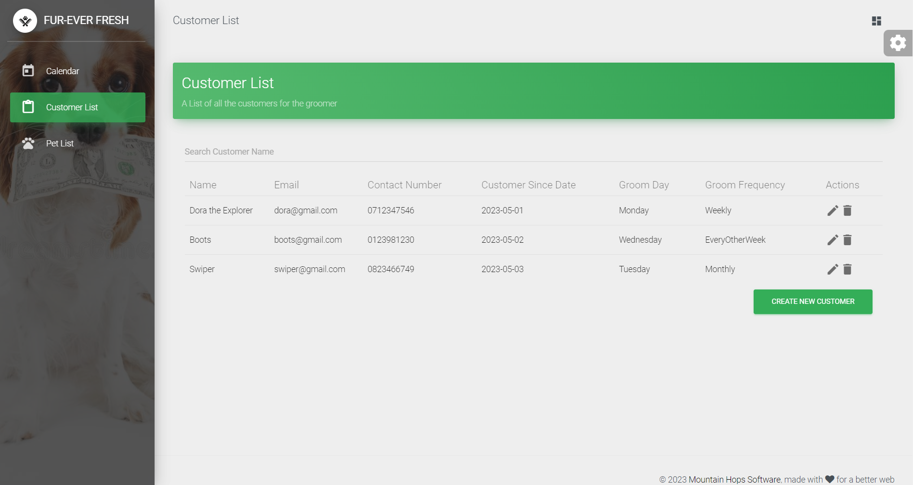
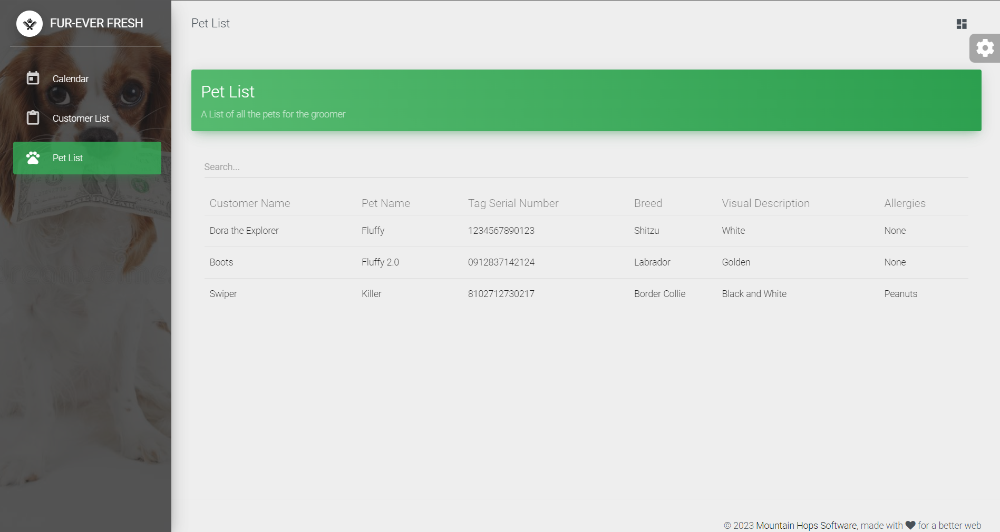

# MHS Technical Test

The MHS Technical Test showcased a SaaS solution tailored specifically for "Fur-Ever", a thriving pet grooming business. This cutting-edge software offered an array of unparalleled features designed to optimize and streamline every aspect of the grooming process. With its user-friendly interface, Fur-Ever staff could effortlessly manage appointments, maintain comprehensive pet profiles, and efficiently track grooming services rendered.

## Table of Contents

* [Demo](#demo)
* [Quick Start](#quick-start)
* [Instructions](#instructions)
* [Licensing](#licensing)

## Demo

| Login | Calendar | Customer Tables | Pet Tabls |
| --- | --- | --- | --- |
|  |  |  |  |

## Quick start

## Dependencies
- `npm`
- `git`
- `dotnet`

## :cloud: Build Setup
- Clone the repo: `git clone https://github.com/jpdlr/MHS-Technical-Test`.

### Change Directory
`cd MHS-Technical-Test`

### Run Batch Script
`.\run.bat`

---

### Batch Script Contains
### Fronted
1. change route
`cd frontend`
2. install dependencies
`npm install`
3. serve with hot reload at localhost:8080
`npm run serve`

### Backend
1. change route
`cd backend`
2. run backend
`dotnet run`

---

## Instructions
1. Click "Register" to create an account.
2. Use your email and password to log in after creating an account.
3. The main page displays a calendar view of all events.  
&emsp;  - Clicking on an empty slot prompts you to add a customer.  
4. On the left menu, choose "Customer Lists" or "Pet Lists" for the logged-in groomer.  
&emsp;  - The Customer Lists allow you to add, edit, and delete customers.  
&emsp;  - To edit a customer, simply click on the customer in the table.  
5. The Pet List shows details of all pets associated with the groomer.  
&emsp;  - Clicking on a pet takes you to the Customer Details page.

## Licensing

- Copyright 2023 Mountain Hops Software (https://mountainhops.co.za/)
